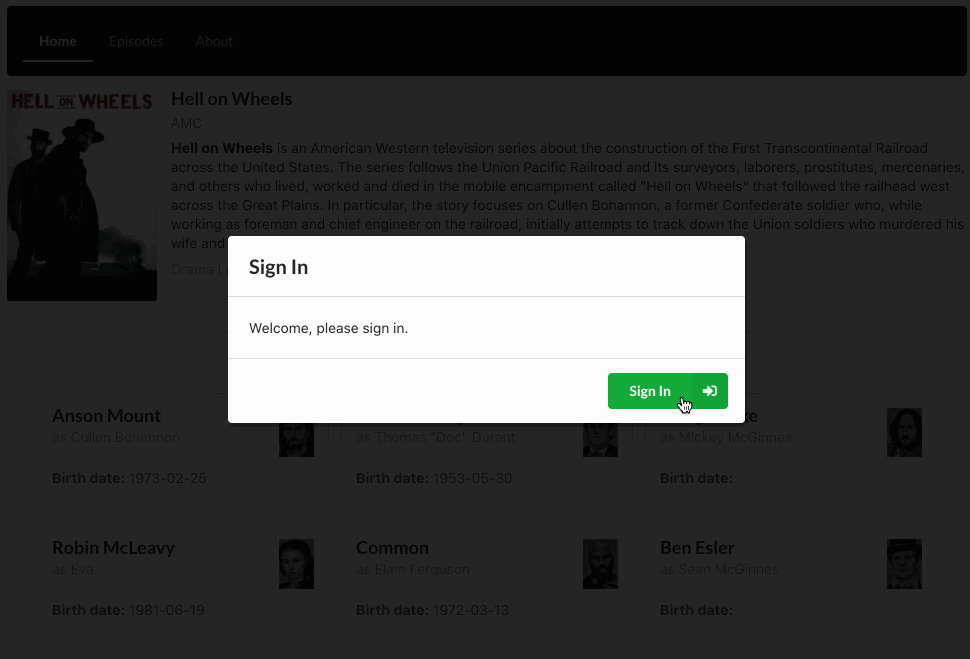

I will be writing an article on the follow code example, but I wanted to share to see if I get any feedback with improvements first.

## Global & Local State with MobX React Example

### A factory function approach to MobX stores with React & Next.js

[View the demo site](https://mobx-local-global-stores.vercel.app/)

[Checkout the repo](https://github.com/codeBelt/mobx-local-global-stores)

### Quick Overview

#### [GlobalStores](https://github.com/codeBelt/mobx-local-global-stores/blob/main/src/stores/GlobalStore.ts)

- **[AuthGlobalStore](https://github.com/codeBelt/mobx-local-global-stores/blob/main/src/stores/auth/AuthGlobalStore.ts)**:
  - Factory function store that uses `observable`
  - A fake auth store to keep track of a user loaded from [randomuser.me](https://randomuser.me/)
- **[ToastGlobalStore](https://github.com/codeBelt/mobx-local-global-stores/blob/main/src/stores/toast/ToastGlobalStore.ts)**:
  - Factory function store that uses `observable`
  - A store that uses [notistack](https://iamhosseindhv.com/notistack) to create a notification (toast) system

#### Local Stores

- **[IndexPageStore](https://github.com/codeBelt/mobx-local-global-stores/blob/main/src/components/pages/index-page/IndexPage.store.ts)**:
  - Factory function store that uses `observable`
  - Makes two requests in the browser to [api.tvmaze.com](https://api.tvmaze.com)
  - Shows a loading indicator and allows the user to sort actors
- **[EpisodesPageStore](https://github.com/codeBelt/mobx-local-global-stores/blob/main/src/components/pages/episodes-page/EpisodesPage.store.ts)**:
  - Factory function store that uses `observable`
  - Hydrated with data that was fetched server-side
  - Allows the user to sort the data on the page that was previously rendered server-side
  - Shows how use the [GlobalStores](https://github.com/codeBelt/mobx-local-global-stores/blob/main/src/stores/GlobalStore.ts) ([getGlobalStore()](https://github.com/codeBelt/mobx-local-global-stores/blob/main/src/components/shared/global-store-provider/GlobalStoreProvider.tsx#L13)) within local stores
- **[AboutPageStore](https://github.com/codeBelt/mobx-local-global-stores/blob/main/src/components/pages/about-page/AboutPage.store.ts)**:
  - ES6 Class store that uses `makeAutoObservable` for comparison
  - A simple store that makes a request to [httpstat.us](https://httpstat.us)
  - Shows how to handle api errors in the local store and on the page
  - Shows how use the [GlobalStores](https://github.com/codeBelt/mobx-local-global-stores/blob/main/src/stores/GlobalStore.ts) ([getGlobalStore()](https://github.com/codeBelt/mobx-local-global-stores/blob/main/src/components/shared/global-store-provider/GlobalStoreProvider.tsx#L13)) within local stores

If you want to see an overview of the files using Mobx check out this [PR Diff](https://github.com/codeBelt/mobx-local-global-stores/pull/4/files).

If you want to check out the example with stores using all ES6 Classes [here is the branch](https://github.com/codeBelt/mobx-local-global-stores/tree/es6-classes). ([PR Diff](https://github.com/codeBelt/mobx-local-global-stores/pull/5/files))

### Feedback Welcomed

If you want to give me feedback on how to improve my usage with MobX, TypeScript types, or Next.js. Create an issue on my [repo](https://github.com/codeBelt/mobx-local-global-stores).

You could also fork my repo and create a PR to show me how you would improve something.

### Help Wanted

- Validate I am following best practice with Mobx and factory functions.
- Help me understand how to remove `runInAction` from [ToastGlobalStore](https://github.com/codeBelt/mobx-local-global-stores/blob/main/src/stores/toast/ToastGlobalStore.ts) and validate I set up [ToastNotifier](https://github.com/codeBelt/mobx-local-global-stores/blob/main/src/components/ui/toast-notifier/ToastNotifier.tsx) correctly.
